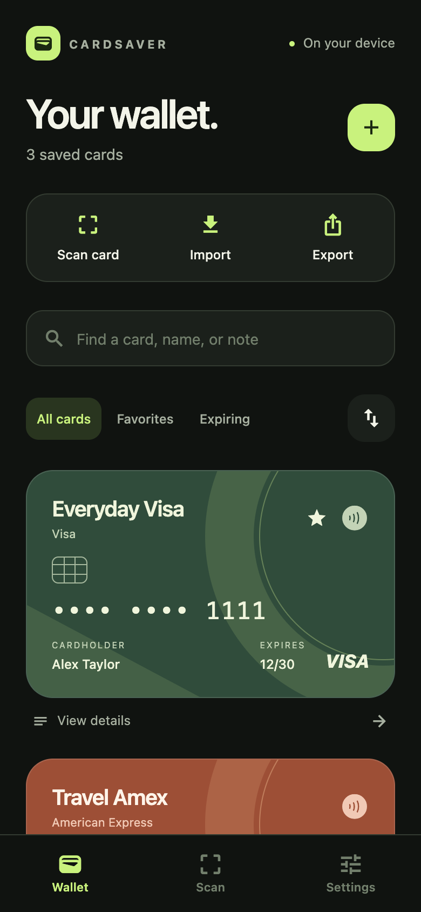
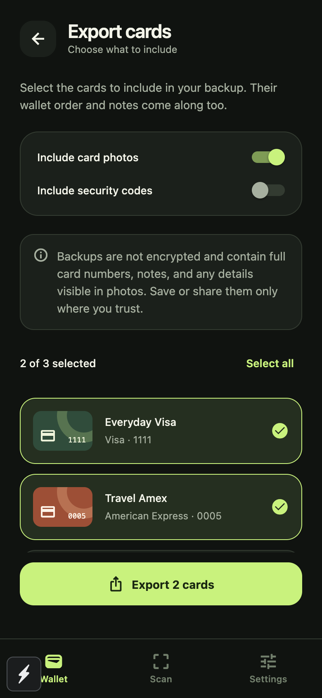

# CardSaver

A wallet for keeping card details, photos, and notes close at hand. Built with Expo, React Native, and TypeScript for iOS, Android, and web.

 

## What’s included

- A refreshed wallet with five card colors, favorites, search, and expiry filters.
- Optional front/back photos from the camera or photo library, plus a note on each card.
- Card details with reveal/hide controls and individual copy actions.
- Drag-to-reorder, accessible move buttons, and an order that survives app restarts.
- An export selection screen with separate photo and security-code options.
- Backup imports with a preview and duplicate detection. Existing cards are preserved; new cards are appended in file order.
- Optional biometric/device authentication across the app, including editor and backup screens.
- Camera scanning, manual entry, optional cardholder/security codes, and unsaved-edit protection.

## Run locally

Use Node 20.19.4 or newer (Node 22 or 24 recommended).

```sh
npm ci
npm run web
```

For the native app, rebuild after installing these changes so the new photo and file modules are included:

```sh
npx expo prebuild
npm run ios
# or
npm run android
```

iOS requires Xcode and CocoaPods; Android requires the Android SDK. The scanner needs a development/native build. On web, use manual entry and photo attachments.

## Using your wallet

**Add a card:** tap **+**, enter its details, choose a color, and optionally attach front/back photos or a note. Cardholder and security code are optional.

**Arrange cards:** tap the reorder button beside the wallet filters. Hold a row to drag it, or use the arrows, then tap **Save order**. Search and favorites never change the saved order.

**Export:** open **Export**, select individual cards or **Select all**, choose whether to include photos/security codes, then export. Mobile opens the system share sheet, where you can save the file. Web downloads a JSON file. Security codes are excluded by default; photos and notes can still contain sensitive details.

**Import:** open **Import**, choose a CardSaver JSON backup, review the preview, and import. Cards with a number already in the wallet—or repeated in the file—are skipped. No existing card is replaced.

## Storage and privacy

Card metadata uses local AsyncStorage. Mobile photos are resized and saved in the app’s document directory; web photos use local browser storage. Exported photos are embedded in the backup, so they work on another device. New installations start empty; existing saved cards are retained.

There is no cloud sync, and CardSaver does not encrypt its storage or backup files. Biometric lock is an access control, not encryption. It is optional, protects all screens, and relocks after a minute away. Card numbers are hidden in the wallet by default. Uninstalling the app or clearing its browser data can remove local cards, so keep a backup where you trust.

Backups support up to 1,000 cards and 25 MB per file. Select fewer cards or exclude photos if the export is too large. Notes allow up to 2,000 characters.

## Checks

```sh
npm run typecheck
npm run lint
npm test
npx expo export --platform all
```

The automated suite covers backup round trips, duplicate handling, order persistence, hydration races, failed storage, expiry validation, scanner extraction, and native photo-file cleanup. See [development notes](docs/development.md) for native integration and validation details.
